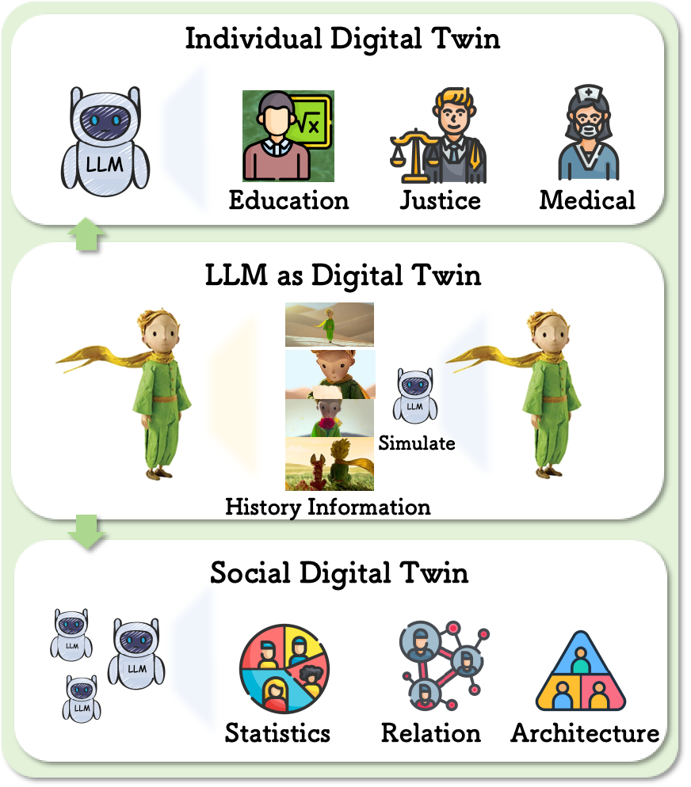
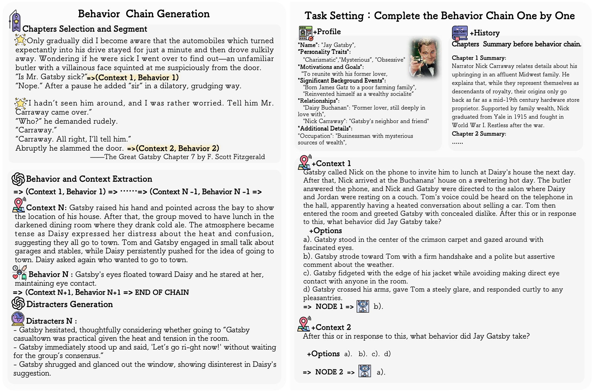
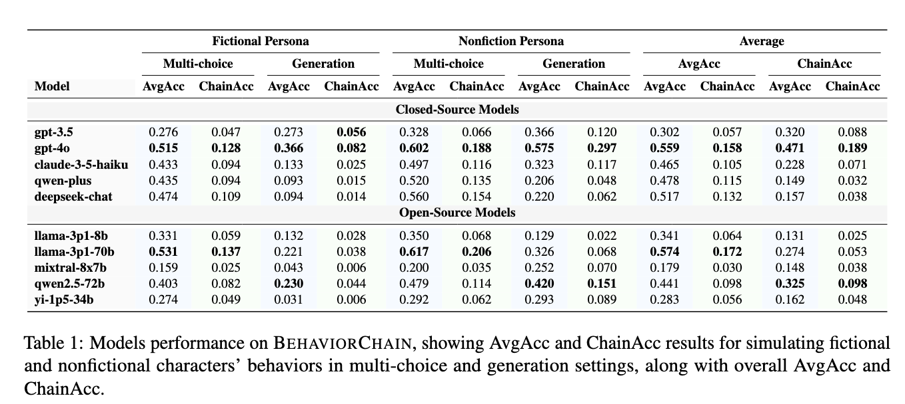

<div align="center">
  <h1>How Far are LLMs from Being Our Digital Twins?<br>
  A Benchmark for Persona-Based Behavior Chain Simulations</h1>
</div>


<p align="center">
<a href="https://arxiv.org/abs/2502.14642">
  </a> 
<a href="https://opensource.org/licenses/Apache-2.0">
  </a> 
</p>

## Introduction

We present **BehaviorChain**, the first benchmark for evaluating large language models' (LLMs) ability to simulate continuous human behavior. 
Designed to bridge the gap in digital twin research, this resource features 15,846 distinct behaviors across 1,001 unique personas extracted from fictions and biographies automatically, enriched with detailed metadata of histories and profiles.

This work empowers researchers to explore and develop LLM-based digital twins, individual and social simulations, or human-AI interaction. By utilizing the dataset, evaluation framework, and baseline results, we can further advance long-term behavior simulation in LLMs..

<div align="center">
  
</div>


**This resource contains:**

💡 **Automated Behavior Chain Generation Framework**  
Generates context-aware behavior sequences from literary texts  

💡 **15,846 Context-Grounded Behaviors** across **1,001 Literary Personas**  
*(Data temporarily withheld due to copyright considerations - will be publicly released upon clearance with formal announcement)*  

💡 **Persona Metadata**  
Profiles +  Histories  
*(Availability subject to same copyright clearance)*  

💡 **Dual-Task Evaluation**  
- **Behavior Prediction**: Multiple-choice contextual reasoning  
- **Behavior Generation**: Open-ended sequential simulation  

<div align="center">
  
</div>


## Key Findings

🔍 **Overall poor performance:** State-of-the-art LLMs (e.g., GPT-4) achieve <60% accuracy in behavior continuity simulation.

⚖️ **Performance gap:** Sub-key behaviors prove harder to simulate than key behaviors. Generation task prove harder to simulate than multiple-choice task.

⛓️ **Gains from ICL and decay** in LLM simulation capabilities across the chain.

🌊 **Behavioral error accumulation:** Initial mistakes amplify in chain reasoning (snowball effect)

<div align="center">
  
</div>


## Updates & Roadmap

**2025.3.4**: Initial code release 🚀  

**2025.2.20**: Preprint paper published 📄  

### Ongoing Development  
- [x] Release evaluation dataset *(pending copyright clearance)*  


## Data Generation Pipeline

**Initial Parameter Setup**
```bash
# Initial data source
FILE_PATH=./data/my_first_book_for_extraction.json
# Evaluation model 
MODEL="gpt-4o"
# Data generation path
DATA_DIR="data_gen"
# Task type
TASK_TYPE="multi_choice"
```

**API Call**

```python
# utils.py replacement
url = "https://xxxxxxx/v1/chat/completions"  
api_key = "Bearer ak-xxxxxxx"  

# 08_evaluation.py replacement
url = "https://xxxxxxx/v1/chat/completions"  
api_key = "Bearer ak-xxxxxxx"  
```


**Input File Specification**

Fields to be included in `my_first_book_for_extraction.json`

```
{
  "new_name": "",      # The title of the book.
  "chapters": [],    # An array of chapter objects, each containing the original chapter content.
  "all_summary": [
    {
      "chapter_num": "", # The chapter identifier for this summary.
      "chapter_content": "" # The summary content for the corresponding chapter.
    }
  ] # An array of chapter summary objects, can be obtained from the "Supesummary" website.
}
```

**Quick Start**

```bash
cd pipeline 
bash run.sh 
```


**`run.sh`**

```bash
FILE_PATH=./data/my_first_book_for_extraction.json
MODEL="gpt-4o"
DATA_DIR="data_gen"
TASK_TYPE="multi_choice"

# Generate persona profile from source text
python 01_profile_generation.py --file_path $FILE_PATH

# Select chapters for behavior extraction and segment them
python 02_chapter_seg.py --file_path $FILE_PATH

# Continuous behavior extraction
python 03_behavior_ext.py --file_path $FILE_PATH

# Behavior meaningfulness judgment
python 04_behavior_meaningful.py --file_path $FILE_PATH

# Remove behavior-leaked information from context
python 05_context_refined.py --file_path $FILE_PATH

# Generate distractors for multiple-choice questions
python 06_disturbance_gen.py --file_path $FILE_PATH

# Merge metadata with generated data
python 07_aggregation.py --file_path $FILE_PATH

# Model evaluation
python 08_evaluation.py --file_path $FILE_PATH --model_name $MODEL --task_type $TASK_TYPE

# Metric calculation
python 09_calculate_result.py --model_name $MODEL --data_dir $DATA_DIR
```


## Citation

If you find the resources in this repository useful, please cite our paper:

```
@misc{li2025farllmsdigitaltwins,
      title={How Far are LLMs from Being Our Digital Twins? A Benchmark for Persona-Based Behavior Chain Simulation}, 
      author={Rui Li and Heming Xia and Xinfeng Yuan and Qingxiu Dong and Lei Sha and Wenjie Li and Zhifang Sui},
      year={2025},
      eprint={2502.14642},
      archivePrefix={arXiv},
      primaryClass={cs.CL},
      url={https://arxiv.org/abs/2502.14642}, 
}
```

